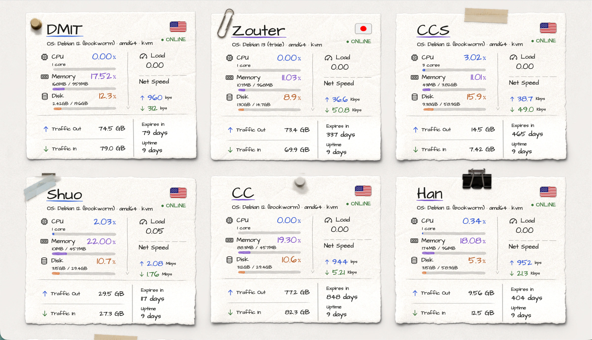

# komari-theme-adhesive-note

把每台服务器变成一张贴在墙上的手写便利贴 —— [Komari Monitor](https://github.com/komari-monitor/komari) 主题。

*Turns every server into a handwritten note stuck on the wall — a theme for Komari Monitor.*

[English](#english) · [中文](#中文)

---

## 中文

### 安装

#### 方式一：主题市场（推荐）

在 Komari 后台 **市场 → 主题市场** 中搜索 `Adhesive Note`，点击安装。

#### 方式二：手动上传

1. 从 [Releases](https://github.com/stqfdyr/komari-theme-adhesive-note/releases) 下载 `komari-theme-adhesivenote-vX.Y.Z.zip`
2. 在 Komari 后台 **设置 → 主题** 中上传该 ZIP
3. 安装后切换到"便利贴 / Adhesive Note"

> 主题需要 Komari **1.0.7 及以上**（RPC2 接口）。

主题没有设置项，装上就是预览图的样子；只有浅色一套，没有夜间模式。

### 许可

主题代码为 MIT。随包分发的字体、国旗等第三方资源有各自的许可，
详见 [THIRD_PARTY.md](./THIRD_PARTY.md)。

---

## English

### Install

**Theme market**: search for `Adhesive Note` under **Market → Themes** in the Komari admin panel.

**Manual**: download `komari-theme-adhesivenote-vX.Y.Z.zip` from
[Releases](https://github.com/stqfdyr/komari-theme-adhesive-note/releases) and upload it
under **Settings → Themes**.

Requires Komari **1.0.7+** (RPC2 API).

The theme exposes no settings — it looks like the preview out of the box, light-only,
with no dark mode.

### License

MIT for the theme itself. Bundled fonts and flag artwork carry their own licenses —
see [THIRD_PARTY.md](./THIRD_PARTY.md).
